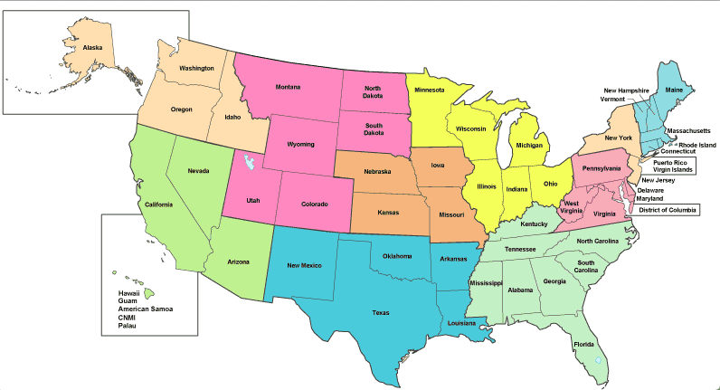

Wow I have always wanted to use python but I have been learning so many helpful things in R! Why don't we use both with reticulate? I can use R to assign something.

```r
library(reticulate)
begin<-"This stuff"
```
Then I can use python to assign something else.

```python
mid="isn't that hard"
print(r.begin,mid)
```

```
## ('This stuff', "isn't that hard")
```
Then I can use both to print it out by referring back to R with "r.". How cool! Can I refer back to python? I sure can.

```r
end="when you do it a lot"
cat(c(begin,py$mid, end))
```

```
## This stuff isn't that hard when you do it a lot
```
What else can I do with the combined power of two awesome softwares and very basic skills?

Using one of my data sets from my project, "Exploratory Data Analysis", I can convert all 50 states to a vector. I had to take out the average of all states, you will see why later.

```r
library(knitr) 
library(tidyverse)
```

```
## ── Attaching packages ────────────────────────────────────────────────────────────────────── tidyverse 1.3.0 ──
```

```
## ✓ ggplot2 3.2.1            ✓ purrr   0.3.3       
## ✓ tibble  2.99.99.9014     ✓ dplyr   0.8.99.9000 
## ✓ tidyr   1.0.2            ✓ stringr 1.4.0       
## ✓ readr   1.3.1            ✓ forcats 0.4.0
```

```
## ── Conflicts ───────────────────────────────────────────────────────────────────────── tidyverse_conflicts() ──
## x dplyr::filter() masks stats::filter()
## x dplyr::lag()    masks stats::lag()
```

```r
ex<-read_csv("week16_exercise.csv")
```

```
## Parsed with column specification:
## cols(
##   count = col_double(),
##   state = col_character(),
##   adults = col_double(),
##   men = col_double(),
##   women = col_double(),
##   men_working = col_double(),
##   women_working = col_double(),
##   men_nonworking = col_double(),
##   women_nonworking = col_double()
## )
```

```r
glimpse(ex)
```

```
## Rows: 52
## Columns: 9
## $ count            <dbl> 1, 2, 3, 4, 5, 6, 7, 8, 9, 10, 11, 12, 13, 14, 15, 1…
## $ state            <chr> "All states (average)", "Alabama", "Alaska", "Arizon…
## $ adults           <dbl> 22, 19, 27, 26, 15, 24, 32, 24, 20, 30, 21, 20, 24, …
## $ men              <dbl> 27, 24, 33, 29, 19, 28, 33, 28, 24, 40, 27, 27, 31, …
## $ women            <dbl> 18, 14, 23, 23, 11, 19, 31, 21, 15, 22, 15, 14, 18, …
## $ men_working      <dbl> 28, 25, 31, 31, 21, 29, 34, 29, 23, 40, 27, 29, 32, …
## $ women_working    <dbl> 20, 15, 24, 26, 13, 21, 33, 24, 17, 24, 17, 15, 19, …
## $ men_nonworking   <dbl> 21, 23, 33, 22, 14, 24, 26, 22, 25, 43, 25, 21, 25, …
## $ women_nonworking <dbl> 14, 13, 17, 16, 9, 15, 27, 13, 11, 18, 12, 12, 14, 2…
```

```r
ex<-ex%>%mutate(col=state)%>%select(col)
ex<-ex[-c(1), ]
avector <- as.vector(ex$col)
avector
```

```
##  [1] "Alabama"              "Alaska"               "Arizona"             
##  [4] "Arkansas"             "California"           "Colorado"            
##  [7] "Connecticut"          "Delaware"             "District of Columbia"
## [10] "Florida"              "Georgia"              "Hawaii"              
## [13] "Idaho"                "Illinois"             "Indiana"             
## [16] "Iowa"                 "Kansas"               "Kentucky"            
## [19] "Louisiana"            "Maine"                "Maryland"            
## [22] "Massachusetts"        "Michigan"             "Minnesota"           
## [25] "Mississippi"          "Missouri"             "Montana"             
## [28] "Nebraska"             "Nevada"               "New Hampshire"       
## [31] "New Jersey"           "New Mexico"           "New York"            
## [34] "North Carolina"       "North Dakota"         "Ohio"                
## [37] "Oklahoma"             "Oregon"               "Pennsylvania"        
## [40] "Rhode Island"         "South Carolina"       "South Dakota"        
## [43] "Tennessee"            "Texas"                "Utah"                
## [46] "Vermont"              "Virginia"             "Washington"          
## [49] "West Virginia"        "Wisconsin"            "Wyoming"
```
But what if I want it in python? I can do that! And I can convert from a list to a string to do something very cool!

```python
df=r.avector
df=' '.join(df)
df=df.lower()
df
```

```
## 'alabama alaska arizona arkansas california colorado connecticut delaware district of columbia florida georgia hawaii idaho illinois indiana iowa kansas kentucky louisiana maine maryland massachusetts michigan minnesota mississippi missouri montana nebraska nevada new hampshire new jersey new mexico new york north carolina north dakota ohio oklahoma oregon pennsylvania rhode island south carolina south dakota tennessee texas utah vermont virginia washington west virginia wisconsin wyoming'
```
Then I use what I learned in my Bioinformatics class and I can count the number of times each letter in the alphabet shows up in the names of all 50 states.

```python
counts = {}            
for c in df:     
    if c in counts:    
        counts[c]+=1   
    else:
        counts[c]=1    
for c in counts:
    print(c, "appears", counts[c],"times")
```

```
## (' ', 'appears', 62, 'times')
## ('a', 'appears', 62, 'times')
## ('c', 'appears', 14, 'times')
## ('b', 'appears', 3, 'times')
## ('e', 'appears', 28, 'times')
## ('d', 'appears', 12, 'times')
## ('g', 'appears', 8, 'times')
## ('f', 'appears', 3, 'times')
## ('i', 'appears', 47, 'times')
## ('h', 'appears', 15, 'times')
## ('k', 'appears', 10, 'times')
## ('j', 'appears', 1, 'times')
## ('m', 'appears', 15, 'times')
## ('l', 'appears', 16, 'times')
## ('o', 'appears', 38, 'times')
## ('n', 'appears', 43, 'times')
## ('p', 'appears', 4, 'times')
## ('s', 'appears', 33, 'times')
## ('r', 'appears', 23, 'times')
## ('u', 'appears', 9, 'times')
## ('t', 'appears', 21, 'times')
## ('w', 'appears', 11, 'times')
## ('v', 'appears', 5, 'times')
## ('y', 'appears', 6, 'times')
## ('x', 'appears', 2, 'times')
## ('z', 'appears', 1, 'times')
```
Wow it seems A is the most popular letter and J and Z are the least popular!




